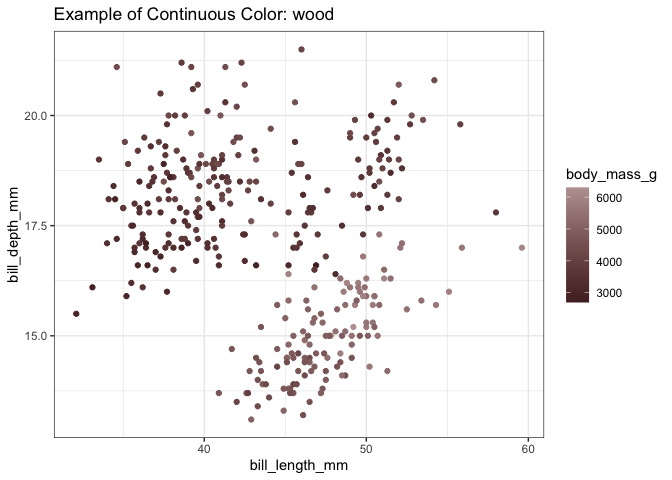

<!-- README.md is generated from README.Rmd. Please edit that file -->

# packageName- pigment

<!-- badges: start -->
<!-- badges: end -->

Pigment is a substance, which leaves a stain/color when mixed. The goal
of **pigment** is to provide access to some regular day to day colors.
The package pigment has one palette- **stain** which includes colors
like yellow, shades of brown like skin, wood and tan, along with 2
different colors like teal and dark pink.

## Installation

The development version of *pigment* with palette *stain* can be
installed in the following way. The result is a set to return
corresponding hexcode of the colour name to the ggplot. Configuration
can be confirmed by using seecol(“colossal\_colours”, col\_bg =
“grey90”, col\_brd = “black”) command.

GitHub\_repo\_url(“<https://github.com/etc5523-2021/r-package-takehome-ratulwadhwa.git>”)

**steps to install pigment package:**

-   install.packages(“devtools”)

-   library(devtools)

-   dev\_mode(on=T)

-   install\_github(“etc5523-2021/r-package-takehome-ratulwadhwa”)

-   when finished do: dev\_mode(on=F)

-   Use install.packages(“pigment”) command to install the package.

-   load library- library(pigment)

``` r
install.packages("devtools")
remotes::install_github("etc5523-2021/r-package-takehome-ratulwadhwa")
```

## Example

This is a basic example which shows you how to solve a common problem:

``` r
library(pigment)
## basic example code
```

``` r
library(pigment)
library(tidyverse)
library(ggplot2)
library(palmerpenguins)

ggplot(penguins, aes(body_mass_g, flipper_length_mm, fill = species)) +
  geom_col() +
pigment::scale_fill_stain_d()+
  labs(title = "Example of Color palette: shows first three colors of the palette")
```


``` r
ggplot(penguins, aes(bill_length_mm, bill_depth_mm, colour = body_mass_g)) +
  geom_point() +
   theme_bw()+
pigment::scale_colour_stain_seq_c("wood")+
  labs(title = "Example of Continuous Color: wood")
```


