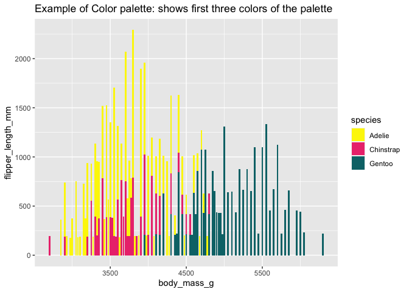

<!-- README.md is generated from README.Rmd. Please edit that file -->

# packageName

<!-- badges: start -->
<!-- badges: end -->

The goal of packageName is to …

## Installation

You can install the development version of packageName with …

``` r
install.packages("devtools")
remotes::install_github("etc5523-2021/r-package-takehome-ratulwadhwa")
```

## Example

This is a basic example which shows you how to solve a common problem:

``` r
library(pigment)
## basic example code
```

``` r
library(pigment)
library(tidyverse)
#> ── Attaching packages ─────────────────────────────────────── tidyverse 1.3.1 ──
#> ✓ ggplot2 3.3.5     ✓ purrr   0.3.4
#> ✓ tibble  3.1.5     ✓ dplyr   1.0.7
#> ✓ tidyr   1.1.4     ✓ stringr 1.4.0
#> ✓ readr   2.0.2     ✓ forcats 0.5.1
#> ── Conflicts ────────────────────────────────────────── tidyverse_conflicts() ──
#> x dplyr::filter() masks stats::filter()
#> x dplyr::lag()    masks stats::lag()
library(ggplot2)
library(palmerpenguins)

ggplot(penguins, aes(body_mass_g, flipper_length_mm, color = species)) +
  geom_col() +
pigment::scale_color_stain_d()+
  labs(title = "color")
#> Warning: Removed 2 rows containing missing values (position_stack).
```


